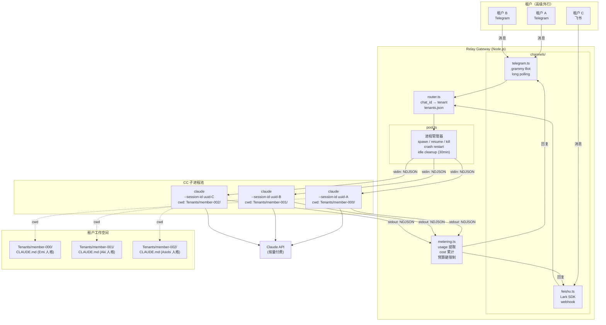
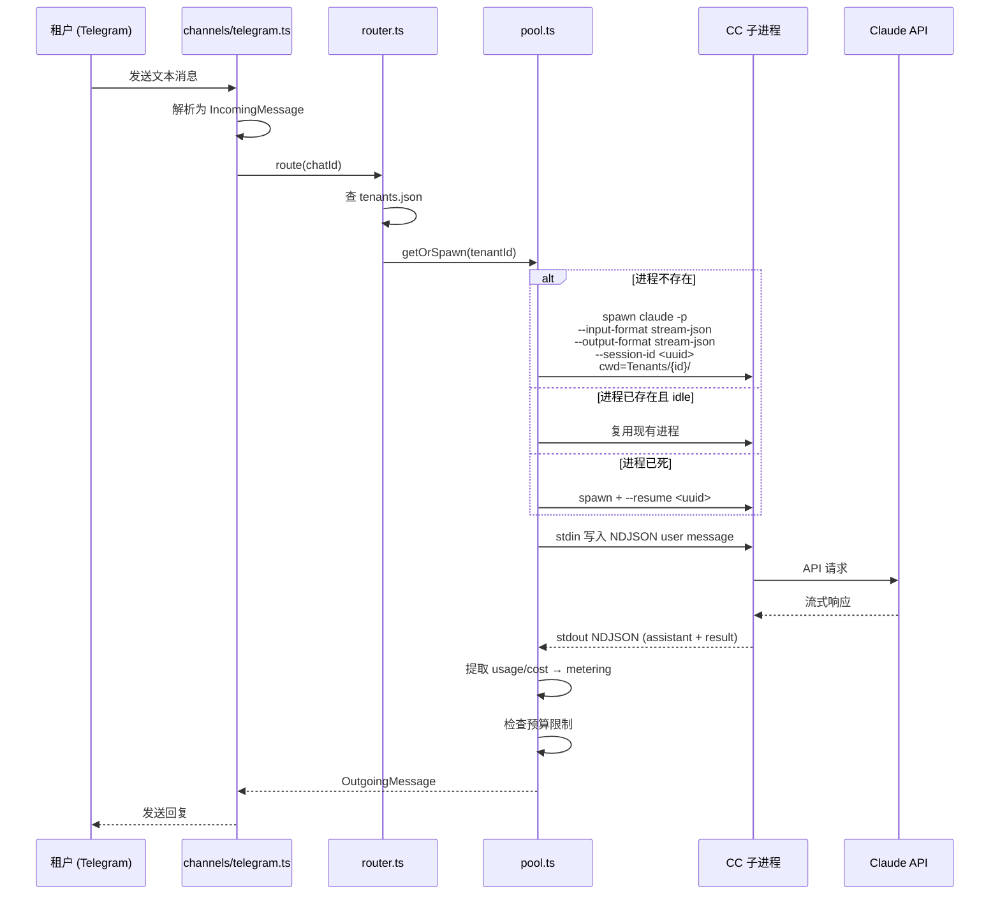
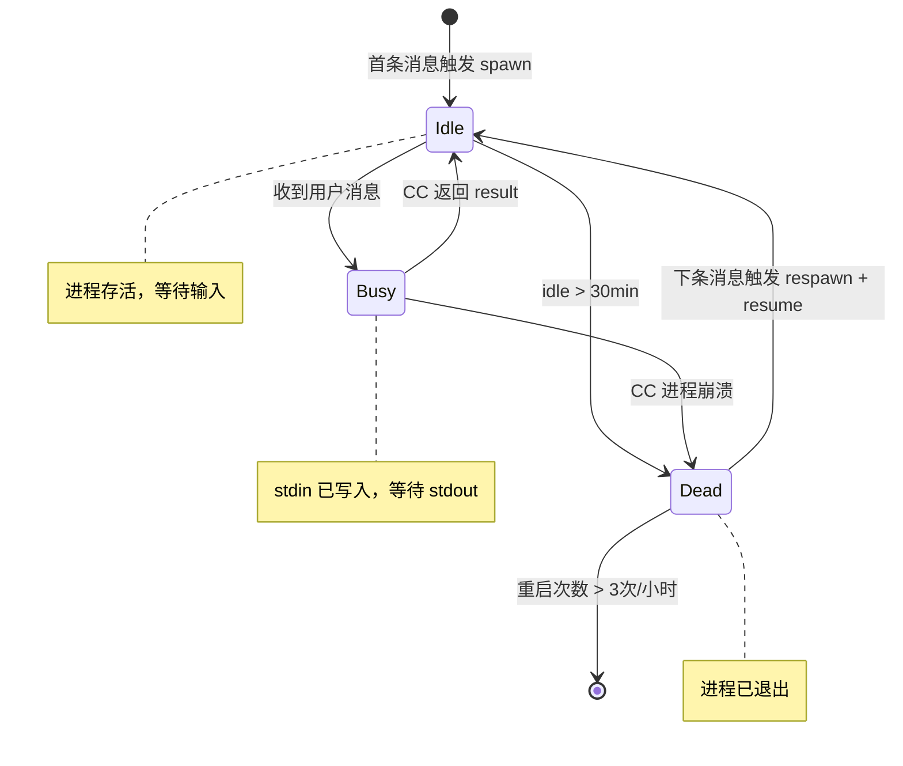
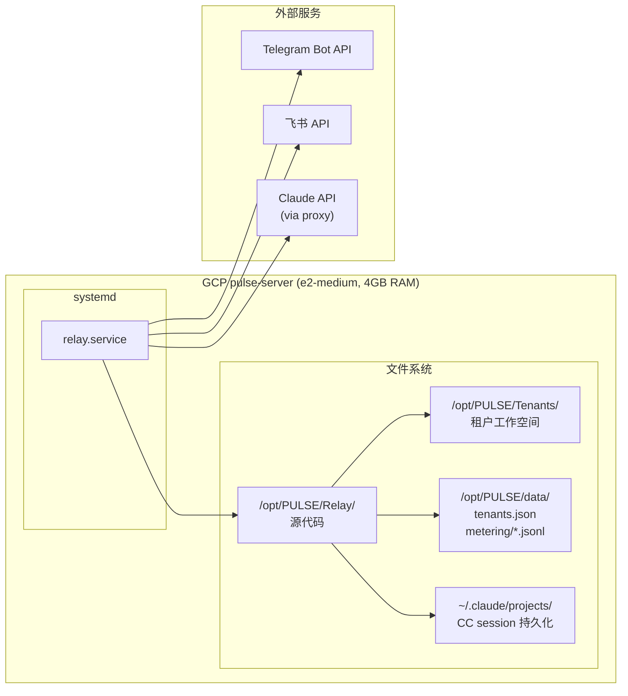
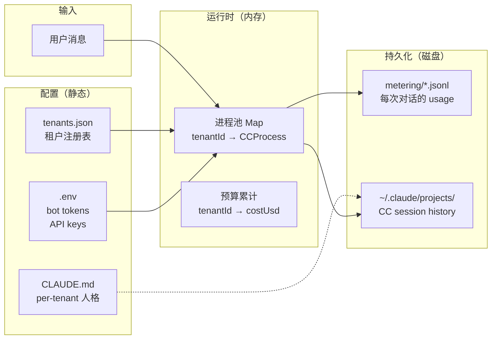

# Relay 系统架构图

## 全局视图

```mermaid
graph TB
    subgraph Users["租户（高级外行）"]
        U1["租户 A<br/>Telegram"]
        U2["租户 B<br/>Telegram"]
        U3["租户 C<br/>飞书"]
    end

    subgraph Relay["Relay Gateway (Node.js)"]
        direction TB
        subgraph Channels["channels/"]
            TG["telegram.ts<br/>grammy Bot<br/>long polling"]
            FS["feishu.ts<br/>Lark SDK<br/>webhook"]
        end

        RT["router.ts<br/>chat_id → tenant<br/>tenants.json"]

        subgraph Pool["pool.ts"]
            PM["进程管理器<br/>spawn / resume / kill<br/>crash restart<br/>idle cleanup (30min)"]
        end

        MT["metering.ts<br/>usage 提取<br/>cost 累计<br/>预算硬限制"]
    end

    subgraph CCPool["CC 子进程池"]
        CC1["claude<br/>--session-id uuid-A<br/>cwd: Tenants/member-000/"]
        CC2["claude<br/>--session-id uuid-B<br/>cwd: Tenants/member-001/"]
        CC3["claude<br/>--session-id uuid-C<br/>cwd: Tenants/member-002/"]
    end

    subgraph Tenants["租户工作空间"]
        T1["Tenants/member-000/<br/>CLAUDE.md (Emi 人格)"]
        T2["Tenants/member-001/<br/>CLAUDE.md (Aki 人格)"]
        T3["Tenants/member-002/<br/>CLAUDE.md (Asobi 人格)"]
    end

    API["Claude API<br/>(按量付费)"]

    U1 -->|消息| TG
    U2 -->|消息| TG
    U3 -->|消息| FS
    TG --> RT
    FS --> RT
    RT --> PM
    PM -->|stdin: NDJSON| CC1
    PM -->|stdin: NDJSON| CC2
    PM -->|stdin: NDJSON| CC3
    CC1 -->|stdout: NDJSON| MT
    CC2 -->|stdout: NDJSON| MT
    CC3 -->|stdout: NDJSON| MT
    MT -->|回复| TG
    MT -->|回复| FS
    CC1 -.->|cwd| T1
    CC2 -.->|cwd| T2
    CC3 -.->|cwd| T3
    CC1 --> API
    CC2 --> API
    CC3 --> API
```

## 消息流（单次交互）

```mermaid
sequenceDiagram
    participant U as 租户 (Telegram)
    participant TG as channels/telegram.ts
    participant R as router.ts
    participant P as pool.ts
    participant CC as CC 子进程
    participant API as Claude API

    U->>TG: 发送文本消息
    TG->>TG: 解析为 IncomingMessage
    TG->>R: route(chatId)
    R->>R: 查 tenants.json
    R->>P: getOrSpawn(tenantId)

    alt 进程不存在
        P->>CC: spawn claude -p<br/>--input-format stream-json<br/>--output-format stream-json<br/>--session-id <uuid><br/>cwd=Tenants/{id}/
    else 进程已存在且 idle
        P->>CC: 复用现有进程
    else 进程已死
        P->>CC: spawn + --resume <uuid>
    end

    P->>CC: stdin 写入 NDJSON user message
    CC->>API: API 请求
    API-->>CC: 流式响应
    CC-->>P: stdout NDJSON (assistant + result)
    P->>P: 提取 usage/cost → metering
    P->>P: 检查预算限制
    P-->>TG: OutgoingMessage
    TG-->>U: 发送回复
```

## 进程生命周期

```mermaid
stateDiagram-v2
    [*] --> Idle: 首条消息触发 spawn

    Idle --> Busy: 收到用户消息
    Busy --> Idle: CC 返回 result
    Idle --> Dead: idle > 30min
    Busy --> Dead: CC 进程崩溃
    Dead --> Idle: 下条消息触发 respawn + resume
    Dead --> [*]: 重启次数 > 3次/小时

    note right of Idle: 进程存活，等待输入
    note right of Busy: stdin 已写入，等待 stdout
    note right of Dead: 进程已退出
```

## 部署视图

```mermaid
graph LR
    subgraph GCP["GCP pulse-server (e2-medium, 4GB RAM)"]
        subgraph Systemd["systemd"]
            RS["relay.service"]
        end

        subgraph Filesystem["文件系统"]
            CODE["/opt/PULSE/Relay/<br/>源代码"]
            TENANTS["/opt/PULSE/Tenants/<br/>租户工作空间"]
            DATA["/opt/PULSE/data/<br/>tenants.json<br/>metering/*.jsonl"]
            SESSIONS["~/.claude/projects/<br/>CC session 持久化"]
        end
    end

    subgraph External["外部服务"]
        TGAPI["Telegram Bot API"]
        LKAPI["飞书 API"]
        CAPI["Claude API<br/>(via proxy)"]
    end

    RS --> CODE
    CODE --> TENANTS
    CODE --> DATA
    CODE --> SESSIONS
    RS --> TGAPI
    RS --> LKAPI
    RS --> CAPI
```

## 数据流与存储

```mermaid
graph LR
    subgraph Input["输入"]
        MSG["用户消息"]
    end

    subgraph Config["配置（静态）"]
        TJ["tenants.json<br/>租户注册表"]
        CM["CLAUDE.md<br/>per-tenant 人格"]
        ENV[".env<br/>bot tokens<br/>API keys"]
    end

    subgraph Runtime["运行时（内存）"]
        POOL["进程池 Map<br/>tenantId → CCProcess"]
        BUDGET["预算累计<br/>tenantId → costUsd"]
    end

    subgraph Persist["持久化（磁盘）"]
        METER["metering/*.jsonl<br/>每次对话的 usage"]
        SESS["~/.claude/projects/<br/>CC session history"]
    end

    MSG --> POOL
    TJ --> POOL
    CM -.-> SESS
    POOL --> METER
    POOL --> SESS
    ENV --> POOL
```
