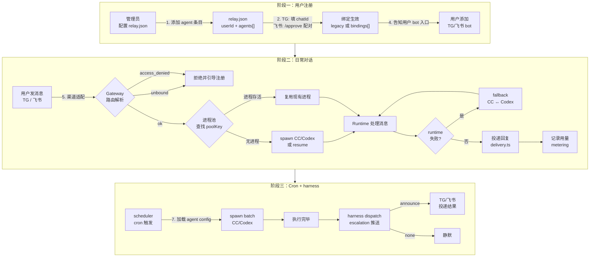
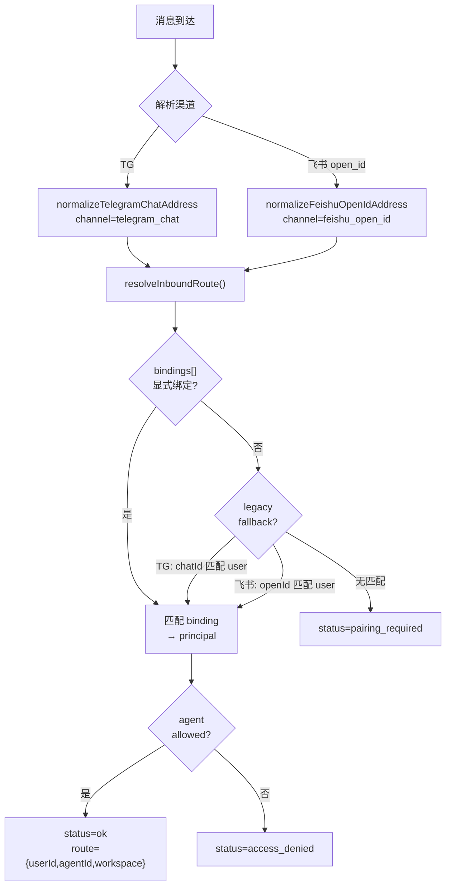
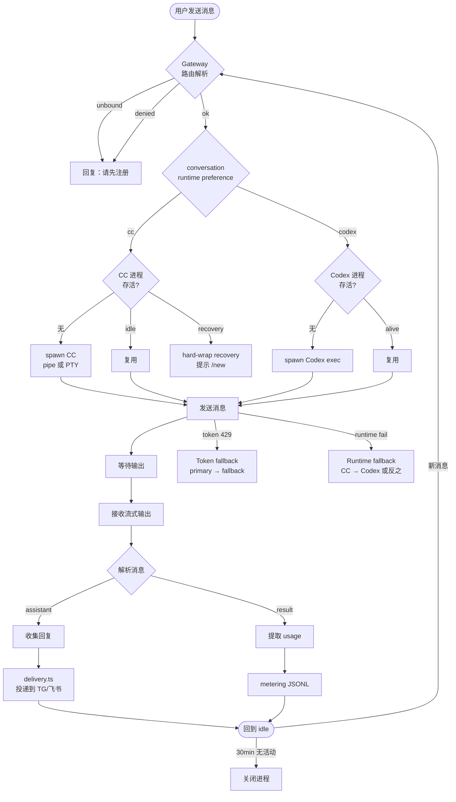
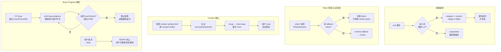
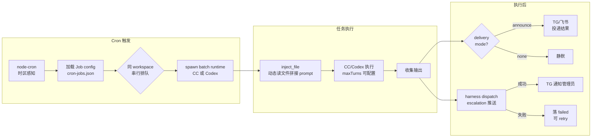
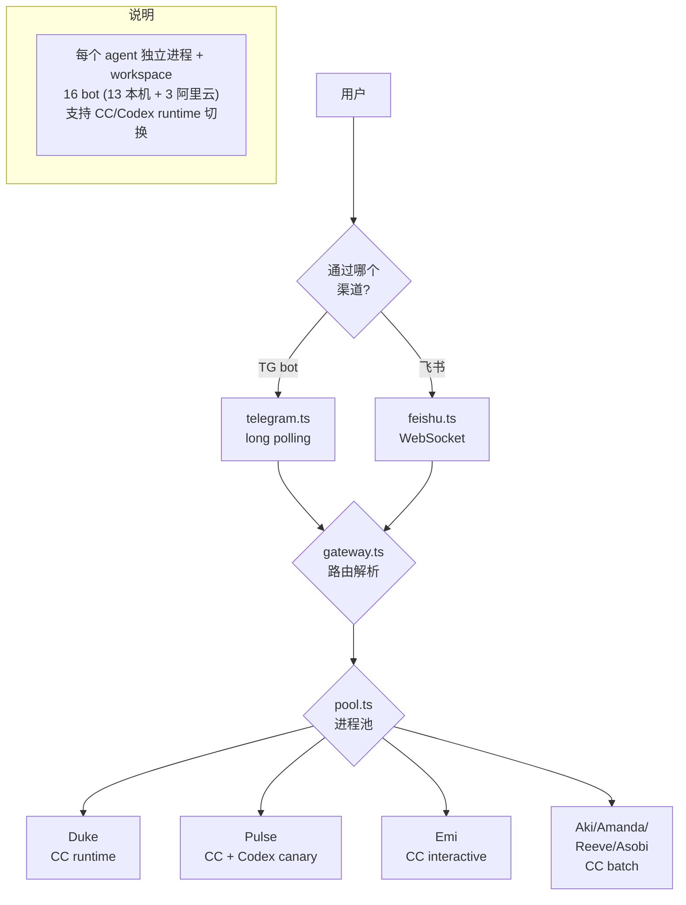

# Relay 业务流程图

## 1. 全局业务流程（端到端）

```mermaid
graph TB
    subgraph Phase1["阶段一：用户注册"]
        A1["管理员<br/>配置 relay.json"] -->|1. 添加 agent 条目| A2["relay.json<br/>userId + agents[]"]
        A2 -->|2. TG: 填 chatId<br/>飞书: /approve 配对| A3["绑定生效<br/>legacy 或 bindings[]"]
        A3 -->|4. 告知用户 bot 入口| A4["用户添加<br/>TG/飞书 bot"]
    end

    subgraph Phase2["阶段二：日常对话"]
        B1["用户发消息<br/>TG / 飞书"] -->|5. 渠道适配| B2{"Gateway<br/>路由解析"}
        B2 -->|unbound| B3["拒绝并引导注册"]
        B2 -->|access_denied| B3
        B2 -->|ok| B4{"进程池<br/>查找 poolKey"}
        B4 -->|无进程| B5["spawn CC/Codex<br/>或 resume"]
        B4 -->|进程存活| B6["复用现有进程"]
        B5 --> B7["Runtime 处理消息"]
        B6 --> B7
        B7 --> B8{"runtime<br/>失败?"}
        B8 -->|是| B9["fallback<br/>CC ↔ Codex"]
        B9 --> B7
        B8 -->|否| B10["投递回复<br/>delivery.ts"]
        B10 --> B11["记录用量<br/>metering"]
    end

    subgraph Phase3["阶段三：Cron + harness"]
        C1["scheduler<br/>cron 触发"] -->|7. 加载 agent config| C2["spawn batch<br/>CC/Codex"]
        C2 --> C3["执行完毕"]
        C3 --> C4["harness dispatch<br/>escalation 推送"]
        C4 -->|announce| C5["TG/飞书<br/>投递结果"]
        C4 -->|none| C6["静默"]
    end

    Phase1 --> Phase2
    Phase2 --> Phase3
```

## 2. 渠道路由流程（Gateway v1.1）

```mermaid
graph TB
    MSG["消息到达"] --> PARSE{"解析渠道"}
    PARSE -->|TG| TG["normalizeTelegramChatAddress<br/>channel=telegram_chat"]
    PARSE -->|飞书 open_id| FS["normalizeFeishuOpenIdAddress<br/>channel=feishu_open_id"]

    TG --> RESOLVE["resolveInboundRoute()"]
    FS --> RESOLVE

    RESOLVE --> CHECK1{"bindings[]<br/>显式绑定?"}
    CHECK1 -->|是| MATCH["匹配 binding<br/>→ principal"]
    CHECK1 -->|否| LEGACY{"legacy<br/>fallback?"}
    LEGACY -->|TG: chatId 匹配 user| MATCH
    LEGACY -->|飞书: openId 匹配 user| MATCH
    LEGACY -->|无匹配| UNBOUND["status=pairing_required"]

    MATCH --> PERMIT{"agent<br/>allowed?"}
    PERMIT -->|是| OK["status=ok<br/>route={userId,agentId,workspace}"]
    PERMIT -->|否| DENY["status=access_denied"]
```

## 3. 对话生命周期

```mermaid
graph TB
    START(["用户发送消息"]) --> GATEWAY{"Gateway<br/>路由解析"}

    GATEWAY -->|unbound| REJECT["回复：请先注册"]
    GATEWAY -->|denied| REJECT
    GATEWAY -->|ok| RUNTIME{"conversation<br/>runtime preference"}

    RUNTIME -->|cc| CC_CHECK{"CC 进程<br/>存活?"}
    RUNTIME -->|codex| CODEX_CHECK{"Codex 进程<br/>存活?"}

    CC_CHECK -->|无| CC_SPAWN["spawn CC<br/>pipe 或 PTY"]
    CC_CHECK -->|idle| CC_REUSE["复用"]
    CC_CHECK -->|recovery| CC_RECOVER["hard-wrap recovery<br/>提示 /new"]

    CODEX_CHECK -->|无| CODEX_SPAWN["spawn Codex exec"]
    CODEX_CHECK -->|alive| CODEX_REUSE["复用"]

    CC_SPAWN --> SEND["发送消息"]
    CC_REUSE --> SEND
    CODEX_SPAWN --> SEND
    CODEX_REUSE --> SEND

    SEND --> WAIT["等待输出"]
    WAIT --> STREAM["接收流式输出"]

    STREAM --> PARSE{"解析消息"}
    PARSE -->|assistant| COLLECT["收集回复"]
    PARSE -->|result| EXTRACT["提取 usage"]

    COLLECT --> DELIVER["delivery.ts<br/>投递到 TG/飞书"]
    EXTRACT --> METER["metering JSONL"]

    DELIVER --> IDLE(["回到 idle"])
    METER --> IDLE
    IDLE -->|30min 无活动| CLEANUP["关闭进程"]
    IDLE -->|新消息| GATEWAY

    SEND -->|token 429| FALLBACK["Token fallback<br/>primary → fallback"]
    SEND -->|runtime fail| RT_FALLBACK["Runtime fallback<br/>CC → Codex 或反之"]
```

## 4. 异常处理流程

```mermaid
graph TB
    subgraph Crash["进程崩溃"]
        E1["exit 事件"] --> E2{"本小时<br/>重启 ≤ 3?"}
        E2 -->|是| E3["respawn + resume<br/>replay in-flight"]
        E2 -->|否| E4["suspended<br/>通知管理员"]
        E3 --> E5["通知用户<br/>已恢复"]
    end

    subgraph TokenFail["Token 限流/认证失败"]
        T1["stderr 检测<br/>429/auth/quota"] --> T2{"有 fallback<br/>token?"}
        T2 -->|是| T3["切换 token<br/>不消耗 restart quota"]
        T2 -->|否| T4["runtime fallback<br/>→ Codex"]
    end

    subgraph ContextFull["Context 满出"]
        B1["检测 context window limit<br/>或 compact failed"] --> B2["标记<br/>recoveryRequiredAt"]
        B2 --> B3["/wrap → hard-wrap<br/>提示 /new"]
        B3 --> B4["用户 /new<br/>自动恢复"]
    end

    subgraph Timeout["Busy Progress 通知"]
        S1["CC busy<br/>超过 busyTimeoutMs"] --> S2["emit busy-progress<br/>通知用户运行时长"]
        S2 --> S3{"达到 maxChecks?<br/>（默认10次）"}
        S3 -->|"否"| S2
        S3 -->|"是"| S4["停止检查<br/>进程继续运行"]
        S5["用户发送<br/>/stop"] --> S6["SIGINT 终止<br/>用户可重发消息继续"]
    end
```

## 5. Cron 调度 + harness 集成

```mermaid
graph LR
    subgraph Schedule["Cron 触发"]
        CRON["node-cron<br/>时区感知"] --> LOAD["加载 Job config<br/>cron-jobs.json"]
        LOAD --> SERIAL{"同 workspace<br/>串行排队"}
        SERIAL --> SPAWN["spawn batch runtime<br/>CC 或 Codex"]
    end

    subgraph Execute["任务执行"]
        SPAWN --> INJECT["inject_file<br/>动态读文件拼接 prompt"]
        INJECT --> RUN["CC/Codex 执行<br/>maxTurns 可配置"]
        RUN --> OUTPUT["收集输出"]
    end

    subgraph PostExec["执行后"]
        OUTPUT --> TG_DELIVER{"delivery<br/>mode?"}
        TG_DELIVER -->|announce| TG["TG/飞书<br/>投递结果"]
        TG_DELIVER -->|none| SILENT["静默"]
        OUTPUT --> HARNESS["harness dispatch<br/>escalation 推送"]
        HARNESS -->|成功| ESCALATE["TG 通知管理员"]
        HARNESS -->|失败| FAILED["落 failed<br/>可 retry"]
    end
```

## 6. 多 Agent 路由（当前生产拓扑）

```mermaid
graph TB
    USER["用户"] --> CHANNEL{"通过哪个<br/>渠道?"}

    CHANNEL -->|TG bot| TG["telegram.ts<br/>long polling"]
    CHANNEL -->|飞书| FS["feishu.ts<br/>WebSocket"]

    TG --> GW{"gateway.ts<br/>路由解析"}
    FS --> GW

    GW --> POOL{"pool.ts<br/>进程池"}

    POOL --> AGENT1["Duke<br/>CC runtime"]
    POOL --> AGENT2["Pulse<br/>CC + Codex canary"]
    POOL --> AGENT3["Emi<br/>CC interactive"]
    POOL --> AGENT4["Aki/Amanda/<br/>Reeve/Asobi<br/>CC batch"]

    subgraph Note["说明"]
        N1["每个 agent 独立进程 + workspace<br/>16 bot (13 本机 + 3 阿里云)<br/>支持 CC/Codex runtime 切换"]
    end
```
